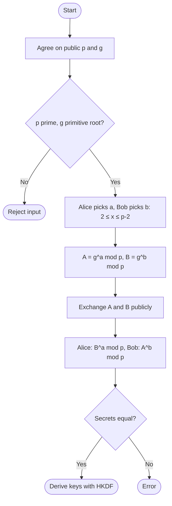
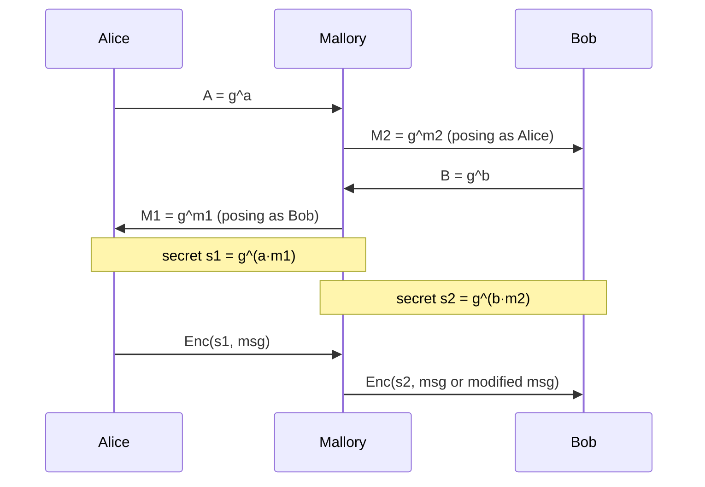
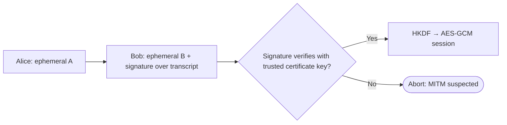

# Flowcharts (Mermaid)

## Diffie–Hellman exchange

```mermaid
flowchart TD
  S([Start]) --> P[Agree on public p and g]
  P --> V{p prime, g primitive root?}
  V -- No --> E([Reject input])
  V -- Yes --> K[Alice picks a, Bob picks b: 2 ≤ x ≤ p-2]
  K --> PK[A = g^a mod p, B = g^b mod p]
  PK --> X[Exchange A and B publicly]
  X --> SS[Alice: B^a mod p, Bob: A^b mod p]
  SS --> M{Secrets equal?}
  M -- Yes --> D([Derive keys with HKDF])
  M -- No --> F([Error])
```

## Man-in-the-middle attack

```mermaid
sequenceDiagram
  participant A as Alice
  participant M as Mallory
  participant B as Bob
  A->>M: A = g^a
  M->>B: M2 = g^m2 (posing as Alice)
  B->>M: B = g^b
  M->>A: M1 = g^m1 (posing as Bob)
  Note over A,M: secret s1 = g^(a·m1)
  Note over M,B: secret s2 = g^(b·m2)
  A->>M: Enc(s1, msg)
  M->>B: Enc(s2, msg or modified msg)
```

## Authenticated exchange (conceptual)

```mermaid
flowchart LR
  A[Alice: ephemeral A] --> B[Bob: ephemeral B + signature over transcript]
  B --> V{Signature verifies with trusted certificate key?}
  V -- Yes --> H[HKDF → AES-GCM session]
  V -- No --> X([Abort: MITM suspected])
```
